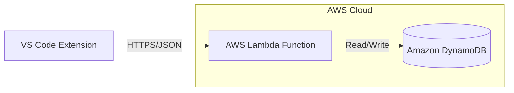

# AWS & Backend Setup Guide for Vitals

## ⚠️ CRITICAL: The "Forever Free" Myth

Before you start, it is crucial to understand AWS Free Tier types:

1. **Always Free**: These never expire (e.g., Lambda 1M requests/mo, DynamoDB 25GB).
2. **12-Months Free**: These **EXPIRE** after 1 year (e.g., **EC2** compute, **RDS PostgreSQL** database, S3 standard).
3. **Trials**: Short term (e.g., SageMaker 2 months).

**Important for this project:**
Since you requested **PostgreSQL**, you will likely use **Amazon RDS**.

- **RDS is FREE for 12 months only.**
- After 1 year, you will be charged (~$15-30/month for the smallest instance).
- *Alternative for true "Forever Free"*: Use **DynamoDB** (NoSQL) which is AWS native and always free, OR use a specialized free Postgres provider like **Supabase** or **Neon** (external to AWS) while keeping your compute on AWS.

---

## 🚀 Phase 1: Account Setup & Security

### 1. Create Account

- Go to [aws.amazon.com/free](https://aws.amazon.com/free).
- Sign up. You will need a credit card (for identity verification) and a phone number.

### 2. Secure the Root User (DO THIS IMMEDIATELY)

The "Root User" is the email you signed up with. It has unlimited power.

1. Log in as Root.
2. Go to **IAM Identity Center** (or just IAM).
3. **Enable MFA (Multi-Factor Authentication)** for the Root user. Use an app like Google Authenticator or Authy.
4. **Do not use the Root user for daily tasks.**

### 3. Create an Admin User

1. In IAM, go to **Users** -> **Create user**.
2. Name: `vitals-admin`.
3. Attach policies directly: `AdministratorAccess`.
4. Create access keys (for CLI) only if necessary later. For now, just set up a password and MFA for this user too.
5. Log out of Root and log in as `vitals-admin`.

### 4. 💰 Set Up a "Zero Spend" Budget (CRITICAL)

AWS does not stop services when you hit free limits; it charges you.

1. Search for **Budgets** in the console.
2. Click **Create budget**.
3. Select **Zero spend budget**.
4. Enter your email for alerts.
5. This will email you the moment you incur $0.01 in charges.

---

## 🏗️ Phase 2: Backend Architecture Plan

We will build a lightweight telemetry and user management backend using **DynamoDB** for a truly free experience.

### Architecture Diagram

### Components

1. **Compute: AWS Lambda**
    - **Why?** It falls under the "Always Free" tier (400,000 GB-seconds/month).
    - Perfect for sporadic traffic from an extension.
    - No server management.

2. **Database: Amazon DynamoDB (NoSQL)**
    - **Why?** Truly "Always Free" (up to 25GB storage, 25 WCU/RCU).
    - **Performance:** Single-digit millisecond latency.
    - **Cost:** $0.00/month indefinitely if within limits.

3. **API Gateway**
    - Front door for the Lambda function.
    - Free tier includes 1 million calls/month.

---

## 📝 Phase 3: Database Schema (DynamoDB)

We will use a **Single Table Design** to store:

1. **Users**: GitHub ID, email.
2. **Telemetry**: Anonymous usage stats.

See `backend/README.md` for the detailed schema.

## ✅ Checklist for You

- [ ] Create AWS Account
- [ ] Enable MFA on Root
- [ ] Create `vitals-admin` IAM User
- [ ] Set up Zero Spend Budget
- [ ] **You are all set for the Forever Free tier!**
- [ ] Confirm if you accept the 12-month limit on RDS Postgres OR if you want to switch to DynamoDB (Forever Free).
