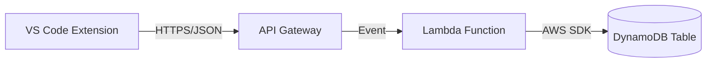

# Vitals Backend (DynamoDB Version)

This is the backend service for the Vitals VS Code extension, designed to run on AWS Free Tier.

## Stack

- **Runtime**: Node.js 18+
- **Framework**: Serverless Framework (or AWS SAM)
- **Database**: Amazon DynamoDB (NoSQL, Always Free Tier eligible)
- **Compute**: AWS Lambda
- **API**: Amazon API Gateway

## Architecture



## Data Model (Single Table Design)

We use a single DynamoDB table named `Vitals` to store both users and telemetry.

### Partition Key (PK) & Sort Key (SK) Strategy

| Entity Type | PK | SK | Attributes | Access Pattern |
|:---|:---|:---|:---|:---|
| **User** | `USER#<GitHubID>` | `PROFILE` | `email`, `username`, `lastLogin` | Get User Profile |
| **Event** | `USER#<GitHubID>` | `EVENT#<Timestamp>` | `eventName`, `properties` | Get User History |
| **Global** | `GLOBAL#STATS` | `METRIC#<Name>` | `count`, `lastUpdated` | Global Aggregates |

## Setup

1. **Install Dependencies**:

    ```bash
    npm install
    ```

2. **Deploy to AWS**:
    We will use the Serverless Framework to deploy the infrastructure.

    ```bash
    npx serverless deploy
    ```

## Local Development

You can use `dynamodb-local` to test without hitting real AWS.
