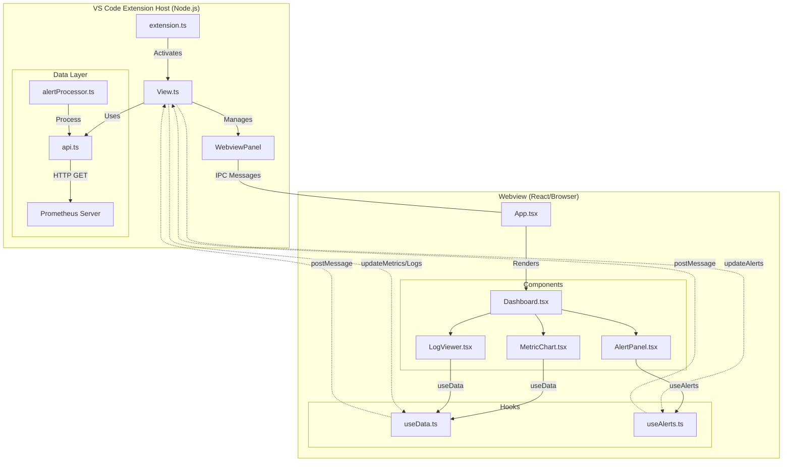

# Architecture

## Overview

Vitals is a VS Code extension that provides real-time monitoring of application metrics and logs from Prometheus, integrated directly into the editor.



## Architecture Layers

### 1. Extension Layer (`src/extension.ts`)

- Entry point for VS Code extension
- Registers `vitals.openDashboard` command
- Manages extension lifecycle (activate/deactivate)

### 2. Webview Management Layer (`src/View.ts`)

- Creates and manages VS Code webview panel
- Handles IPC communication between extension and React frontend
- Manages commands:
  - `fetchMetrics` → calls Prometheus API
  - `fetchAlerts` → retrieves active alerts
  - `fetchLogs` → provides mock log data

### 3. API Layer (`src/api.ts`)

- `PrometheusApi` class for Prometheus communication
- Methods:
  - `getAlerts()` → `/api/v1/alerts`
  - `query(query)` → `/api/v1/query`
- Error handling and HTTP client setup

### 4. Data Processing (`src/data/`)

- `alertProcessor.ts` - Evaluates alert thresholds
- `fetchMetrics.ts` - Fetches metrics with config

### 5. React Frontend (`webview/src/`)

- `App.tsx` - Root component
- `components/` - UI components:
  - `dashboard.tsx` - Main layout
  - `MetricChart.tsx` - Chart visualization
  - `AlertPanel.tsx` - Alert display
  - `LogViewer.tsx` - Log stream
- `hooks/` - Custom React hooks for data fetching

## Data Flow

```text
User triggers "vitals.openDashboard" command
        ↓
extension.ts registers command → calls View.createOrShow()
        ↓
View.ts creates webview panel
        ↓
React App renders (App.tsx → Dashboard component)
        ↓
Components call hooks (useData, useAlerts)
        ↓
Hooks send IPC messages to extension
        ↓
Extension (View.ts) receives message and calls PrometheusApi
        ↓
PrometheusApi queries Prometheus endpoint
        ↓
Response sent back to webview via IPC
        ↓
Components update and re-render
```

## Key Dependencies

| Package               | Purpose                              |
| --------------------- | ------------------------------------ |
| `axios`               | HTTP client for Prometheus API calls |
| `@observablehq/plot`  | Data visualization library           |
| `react` & `react-dom` | UI framework                         |
| `@types/vscode`       | VS Code API types                    |
| `webpack`             | Module bundler                       |
| `typescript`          | Type safety                          |

## Configuration

Extension reads from VS Code settings:

```json
{
  "vitals.prometheusUrl": "http://localhost:9090"
}
```

## IPC Message Protocol

**Webview → Extension:**

```javascript
{ command: "fetchMetrics", query: "up" }
{ command: "fetchAlerts" }
{ command: "fetchLogs" }
```

**Extension → Webview:**

```javascript
{ command: "updateMetrics", data: {...} }
{ command: "updateAlerts", data: {...} }
{ command: "updateLogs", data: [...] }
{ command: "error", message: "..." }
```

## Security

- Content Security Policy enforced in HTML template
- Webview has limited resource roots (only build directory)
- Scripts enabled for React interactivity

## Build & Distribution

- **Build**: `npm run build` (bundles extension + webview)
- **Watch**: `npm run watch` (development mode)
- **Publish**: `npm run vscode:prepublish` then publish to VSCode Marketplace
